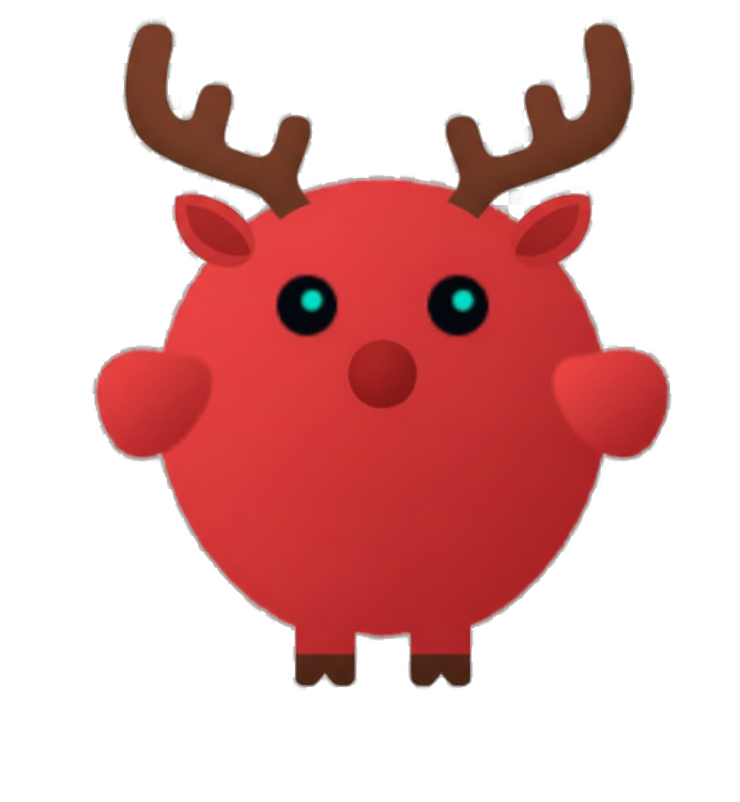

                                                                                                      
  
                                      
    
    <h1>OpenMoose</h1>
    
<strong>Enterprise-grade Semantic-layer AI Agents Collaboration Platform</strong>

    <a href="https://openmoose.ai">Website</a> ·
    <a href="https://twitter.com/_Chelsey404">Twitter</a> ·
    <a href="mailto:hello@openmoose.ai">Contact</a>

    
    
  

  ---

  ## What is OpenMoose?

  OpenMoose is an enterprise AI Agents platform that enables **agent collective intelligence** — a
  fleet of agents that share organizational strategy, methodology, and decision context at the
  semantic layer.

  Most agent frameworks connect tools. **OpenMoose connects intent.**

  ---

  ## The Three-Layer Architecture

  ┌─────────────────────────────────────────┐
  │        Semantic Collaboration Layer      │  ← Semantic Protocol (our core IP)
  │   Strategy · Methodology · Workshops    │
  ├─────────────────────────────────────────┤
  │         Communication Layer             │  ← Cross-agent routing & orchestration
  │    Message passing · State sync         │
  ├─────────────────────────────────────────┤
  │           Network Layer                 │  ← Bottom-level agent connectivity
  │     Agent discovery · Registration      │
  └─────────────────────────────────────────┘

  ---

  ## Core Capabilities

  - **Semantic Collaboration Protocol** — agents align on organizational *why*, not just task *what*
  - **Agent Collective Consciousness** — company strategy & workshops encoded into every agent at
  runtime
  - **Enterprise Orchestration** — connect X agents into a coordinated, intent-driven network
  - **Cross-team Workflow Automation** — detect dependencies, sync progress, eliminate silos

  ---

  ## Why OpenMoose?

  | Problem | OpenMoose |
  |---------|-----------|
  | Agents execute tasks without organizational context | Semantic layer encodes company strategy into
   every agent |
  | Multi-agent systems lose coherence at scale | Collective consciousness keeps all agents aligned |
  | Enterprise AI stays siloed per team | Network layer connects agents across the entire org |

  ---

  ## Get Started

  Visit **[openmoose.ai](https://openmoose.ai)** to request early access or book an enterprise demo.

  ---

  ## Connect

  - 🌐 [openmoose.ai](https://openmoose.ai)
  - 🐦 [@_Chelsey404](https://twitter.com/_Chelsey404)

  ---
